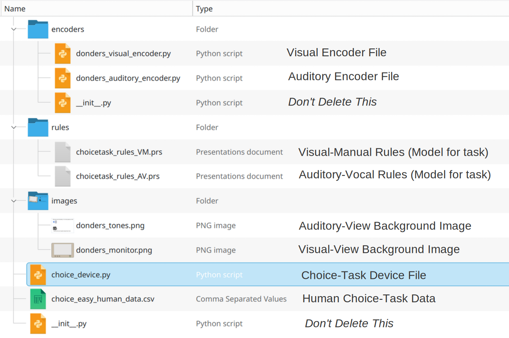

# EPICpyDevices

<table role="presentation" style="border-collapse:collapse;">
  <tr>
    <td style="padding-right:12px; vertical-align:middle;">
      
    </td>
    <td style="vertical-align:middle; font-weight:bold; color:yellow;">
      WARNING, BREAKING CHANGES COMING NEXT WEEK! - Travis Seymour, Oct 24, 2025
    </td>
  </tr>
</table>

## Devices Folder

Sample _Devices_ for the EPICpy variant of the EPIC Computational Cognitive Architecture.

EPICpy is an application for running computational simulations of human performance using the EPIC Cognitive Architecture. To find out more about EPIC and the EPICpy application, see here [https://github.com/travisseymour/EPICpy](https://github.com/travisseymour/EPICpy) or [https://travisseymour.github.io/EPICpyDocs/](https://travisseymour.github.io/EPICpyDocs/).

An EPIC _Device_ minimally consists of the following:

1. Python code representing a virtual task environment (sometimes confusingly referred to as the **Task Device**) in which human performance is to be evaluated. Sometimes, this is a virtual version of a real task previously used in human behavioral experiments. For more information on Devices, see here: [https://travisseymour.github.io/EPICpyDocs/model_programming/#devices](https://travisseymour.github.io/EPICpyDocs/model_programming/#devices)
2. A **Production Rule** file consisting of rules that make up a model of human performance in the task represented by the device. You can think of the production rules as a model for how humans perform the task. For more information on Production Rules, see here: [https://travisseymour.github.io/EPICpyDocs/epicpysimcomponents/#task-rules](https://travisseymour.github.io/EPICpyDocs/epicpysimcomponents/#task-rules)

In EPICpy, a _Device_ could consist of the following:

1. A **Task Device** file (Python)
2. A **Production-Rule** file (proprietary production-rule format)
3. <mark>[Optional]</mark> **Visual and Auditory Perceptual Encoder** files (Python). For information on Perceptual Encoders, see here: [https://travisseymour.github.io/EPICpyDocs/model_programming/#perceptual-encoders](https://travisseymour.github.io/EPICpyDocs/model_programming/#perceptual-encoders))
4. <mark>[Optional]</mark> **Background images** that may underlie th visual and auditory windows that are part of the EPICpy GUI (png)
5. <mark>[Optional]</mark> **Data Files** (usually Human data from a similar task device) that can be compared to the simulated data produced by EPIC (csv, xlsx, etc).

---

The content of a sample Choice-Task Device folder:

For a description of a Choice Task, see here: [https://travisseymour.github.io/EPICpyDocs/example/](https://travisseymour.github.io/EPICpyDocs/example/)

---

## EPICpyDevice Folder

The epicpydevice folder must be included alongside your Device folders. epicpydevice contains base and utility class Python files that define how EPICpy Devices work in Python code.

> It is recommended that it stay in a folder named `epicpydevice` next to your other Device folders. You should avoid editing these files unless you are an experienced Python programmer.
